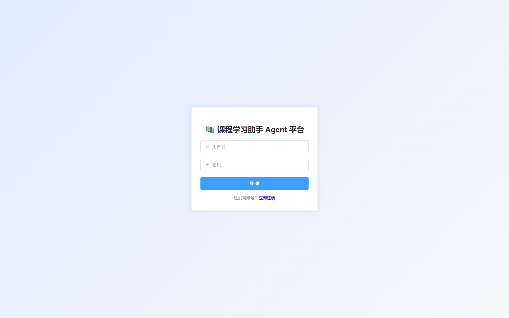
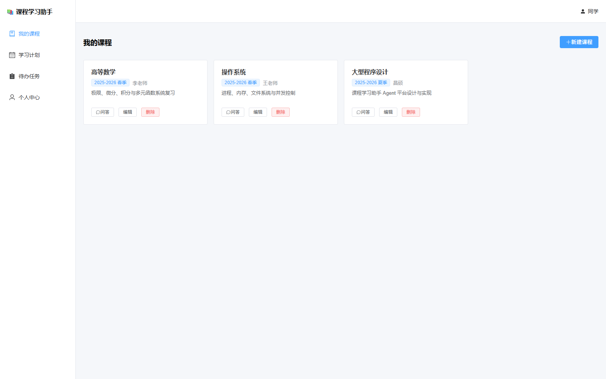
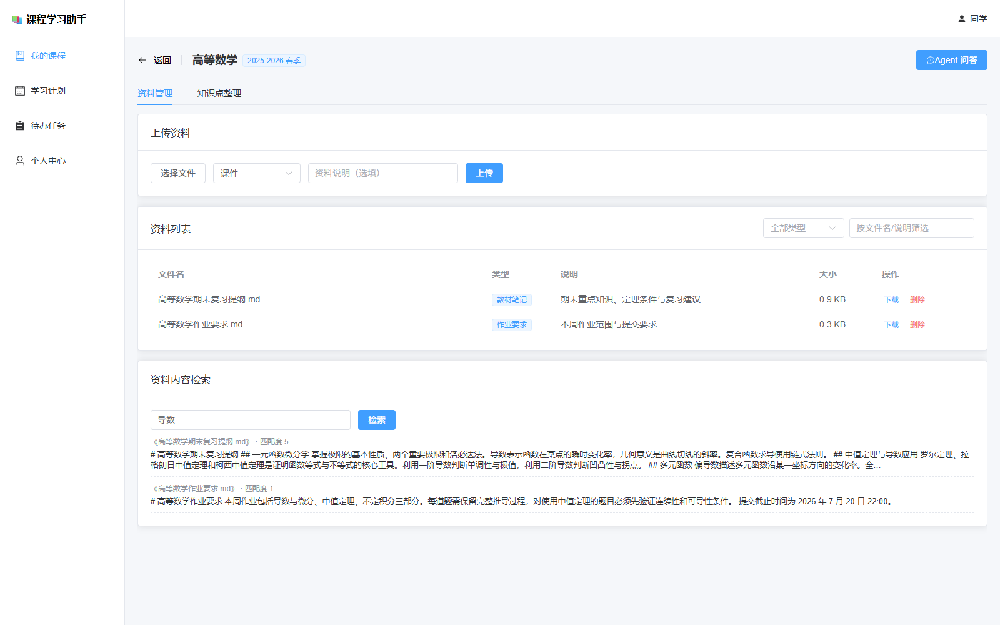
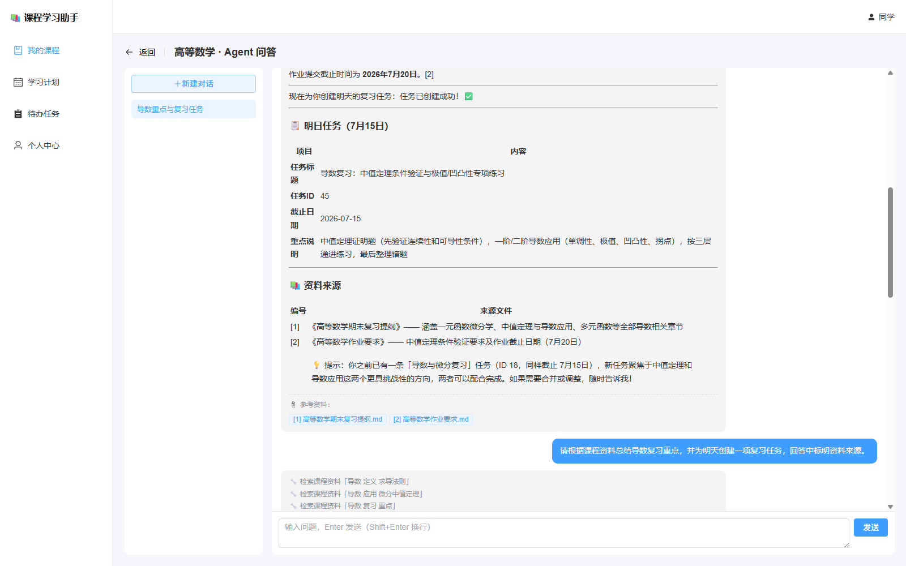
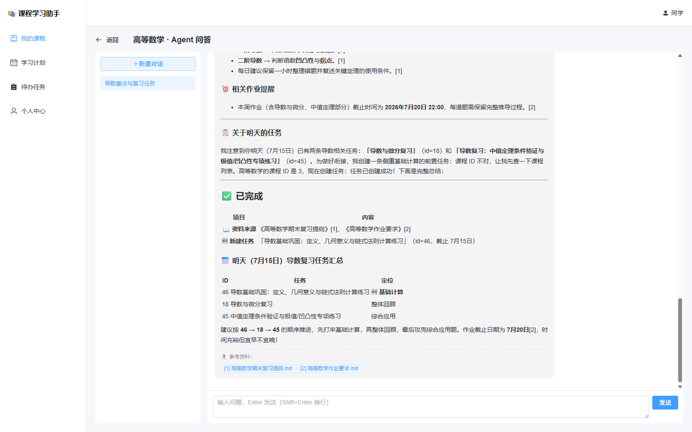
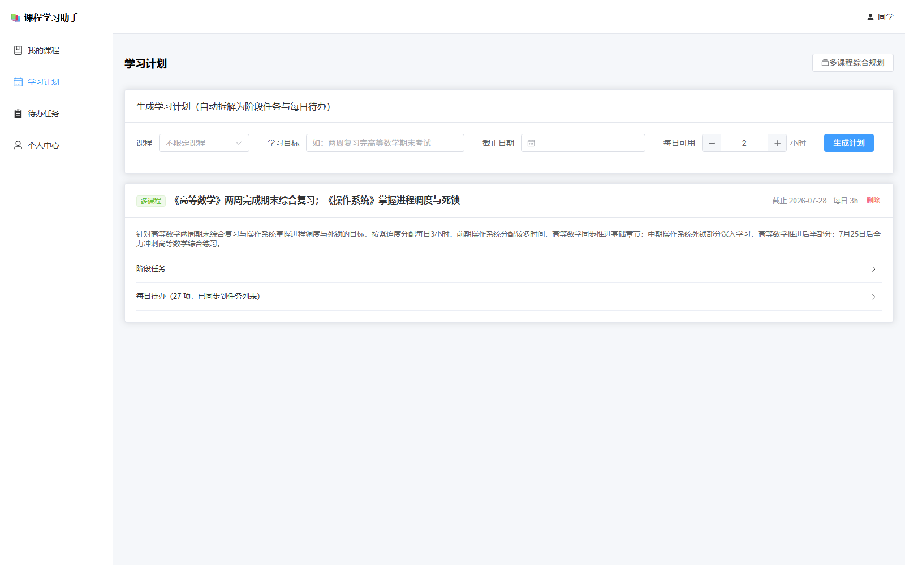
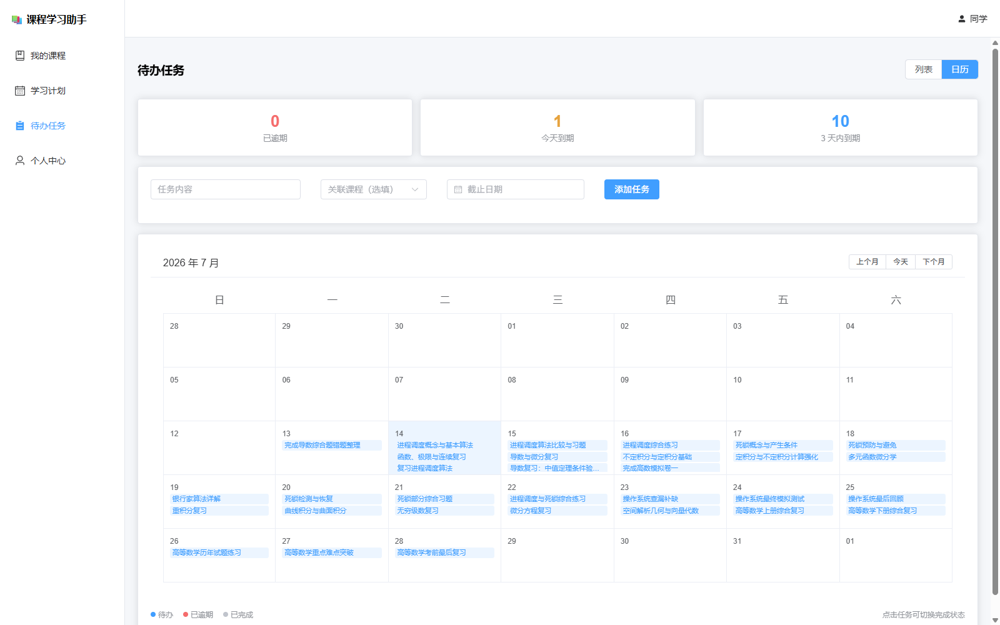
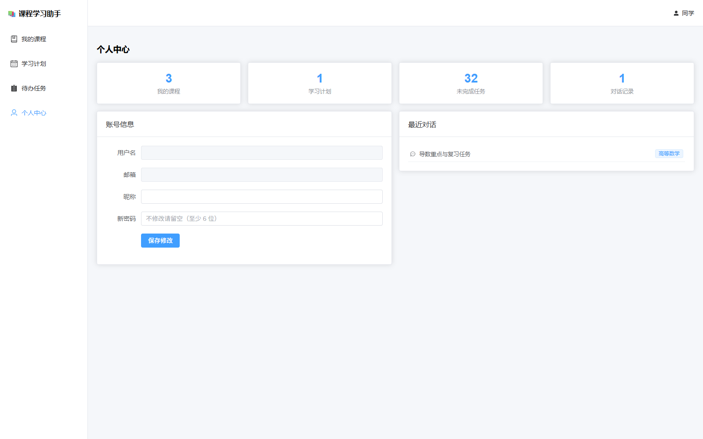

# 摘要

随着高校课程数量和数字化教学资源不断增加，学生通常需要在课件、教材笔记、作业要求、实验指导书等多种资料之间反复切换。传统文件夹只能完成静态存储，难以同时解决资料定位、重点提炼、学习安排和任务提醒问题。针对上述痛点，本项目设计并实现了一个通用的课程学习助手 Agent 平台。平台以课程为核心组织学习资料，通过大模型工具调用机制，将资料检索、课程查询、任务管理和学习计划保存等操作封装为可执行工具，使智能体能够根据学生意图自主选择工具、执行多轮检索，并在获得足够信息后生成回答。

系统采用前后端分离架构。前端使用 Vue 3、Vue Router、Pinia 和 Element Plus 构建课程管理、资料管理、Agent 对话、学习计划、待办任务和个人中心等页面；后端使用 FastAPI、SQLAlchemy 2.0 和 Pydantic v2 提供 RESTful API，以 SQLite 保存业务数据，并以本地文件系统保存上传资料。系统支持 TXT、Markdown、PDF、DOCX、PPTX 等文件的文本抽取和滑动窗口切片；配置 Embedding 服务时使用余弦相似度进行语义检索，未配置或调用失败时自动降级为关键词检索。Agent 同时兼容 Anthropic 和 OpenAI 两类协议，并通过服务器发送事件实现文本增量和工具调用过程的实时展示。

在原始需求基础上，系统完成了资料来源引用、知识点整理、智能任务拆解和多课程学习规划四项高级功能，并增加离线降级、到期提醒、日历视图、跨用户数据隔离、Markdown 安全消毒等工程能力。当前版本提供 33 个 API 操作、8 张业务数据表和 10 个 Agent 工具。自动化验证包括 42 项后端测试和 2 项前端安全渲染测试，生产构建成功，前端依赖审计结果为 0 个已知漏洞。结果表明，该平台能够形成“资料入库—内容检索—Agent 推理—计划执行—任务反馈”的学习闭环。

**关键词：** 课程学习助手；智能体；检索增强生成；工具调用；学习计划；FastAPI；Vue 3

<!-- pagebreak -->

# 目录

[TOC]

<!-- pagebreak -->

# 1 课程设计目的

## 1.1 项目背景

大学课程学习具有资料类型多、时间跨度长和任务并行度高等特点。一门课程往往同时包含教师课件、教材章节、课堂笔记、实验要求和作业通知，多门课程并行后，文件数量和截止时间迅速增加。学生虽然能够借助网盘或本地文件夹保存资料，但“保存下来”并不等于“能够快速利用”。当学生需要回答某个知识问题时，仍然要逐个打开文件查找；当考试临近时，也缺少将宏观目标自动拆成每日任务的工具。

大语言模型具有自然语言理解和内容生成能力，但直接使用通用对话模型存在两个明显问题：一是模型不了解学生自己的课程资料，回答容易脱离教学内容；二是模型通常只能给出文字建议，不能直接更新课程、计划和待办数据。本项目因此采用检索增强生成与工具调用相结合的 Agent 方案，让模型既能基于私有课程资料回答，又能在授权范围内执行结构化操作。

## 1.2 课程设计目标

本次课程设计的总体目标是按照软件工程方法完成一个可运行、可测试、可扩展的完整 Web 系统，并通过项目实践掌握从需求分析到系统验收的全过程。具体目标如下：

- 以用户和课程为数据边界，建立清晰的数据模型和访问控制规则。
- 实现课程、资料、对话、计划和任务的完整业务闭环。
- 设计统一的大模型访问层，兼容不同协议和第三方兼容服务。
- 实现基于课程资料的检索增强问答，并给出可核查的资料来源。
- 将学习目标转换为阶段计划和每日待办，降低计划执行门槛。
- 通过自动化测试验证核心业务、用户隔离、降级路径和协议适配逻辑。
- 形成结构合理、注释必要、配置集中且便于继续迭代的工程代码。

## 1.3 软件工程实践目标

项目开发不仅关注功能是否能够运行，还强调可维护性和风险控制。系统按表现层、接口层、业务服务层和数据层进行分解；通过 Pydantic Schema 统一参数校验，通过服务模块隔离大模型、检索、文件解析和安全逻辑；通过环境变量区分密钥与普通配置；通过测试临时数据库避免污染真实数据。该过程体现了模块化、信息隐藏、低耦合和阶段验证等软件工程原则。

## 1.4 项目范围

本项目面向个人课程学习场景，当前版本不实现学校统一身份认证、多人共享课程、在线协同编辑和大规模分布式向量数据库。默认部署方式为单机前后端分离部署，数据库使用 SQLite，上传文件保存在服务器本地目录。该边界能够覆盖课程题目要求，并为后续切换 PostgreSQL、对象存储或专业向量数据库保留接口。

<!-- pagebreak -->

# 2 需求分析

## 2.1 原始问题描述

原始需求指出，大学生在多门课程学习过程中经常面临课程资料分散、重点内容难以快速查找、学习计划不清晰、作业与复习任务容易遗漏等问题。系统需要支持用户管理不同课程的学习资料，并通过智能体帮助学生完成课程问答、知识点整理、学习计划生成和待办任务管理，从而提升学习效率。

从问题本质看，系统需要同时解决四类矛盾：资料数量增长与人工查找效率之间的矛盾；通用模型知识与具体课程内容之间的矛盾；宏观学习目标与每日可执行任务之间的矛盾；任务持续产生与学生记忆能力之间的矛盾。由此确定系统的核心业务对象为用户、课程、资料、对话、计划和任务。

## 2.2 用户角色与典型场景

当前版本只有“学生用户”一种业务角色。未登录访问者可以注册和登录；登录用户只能访问自己创建的课程及其关联数据。系统不设置管理员读取学生资料的业务接口，以减少不必要的数据暴露。

| 场景编号 | 场景名称 | 前置条件 | 用户目标 | 系统结果 |
| --- | --- | --- | --- | --- |
| UC-01 | 注册与登录 | 用户未登录 | 建立个人账号 | 返回用户信息和 JWT |
| UC-02 | 创建课程 | 用户已登录 | 建立课程资料空间 | 保存名称、简介、教师和学期 |
| UC-03 | 上传资料 | 已存在课程 | 上传课件或实验指导 | 保存原文件并抽取、切片文本 |
| UC-04 | 资料问答 | 课程存在可检索资料 | 获得基于资料的回答 | Agent 检索并返回带引用回答 |
| UC-05 | 知识点整理 | 课程已有资料 | 生成复习提纲 | 返回 Markdown 知识清单 |
| UC-06 | 生成计划 | 已填写目标和截止日期 | 获得每日学习安排 | 保存计划并生成待办任务 |
| UC-07 | 管理任务 | 用户已登录 | 添加、完成或删除任务 | 更新任务状态并参与提醒 |
| UC-08 | 多课程规划 | 至少存在两门课程 | 综合安排学习时间 | 按课程关联每日任务 |

## 2.3 功能需求

### 2.3.1 前端功能需求

课程管理页面需要支持课程卡片展示、新建、编辑和删除。课程信息至少包含课程名称、课程简介、授课教师和学期。课程详情页需要提供资料上传、类型筛选、文件名或说明筛选、内容片段检索、下载和删除功能。Agent 对话页需要允许用户在指定课程下创建多轮对话，并实时展示模型文本、工具调用过程和资料来源。

学习计划页需要接收学习目标、截止日期和每日可用时间，展示总体说明、阶段任务和每日任务；同时提供多课程综合规划入口。待办任务页需要支持列表视图、日历视图、完成状态切换、逾期标记和三日内提醒。个人中心需要展示课程、计划、未完成任务和对话数量，并支持修改昵称和密码。

### 2.3.2 后端功能需求

后端需要提供安全的注册、登录和个人信息维护功能；建立能够表达用户、课程、资料、切片、对话、消息、计划和任务关系的数据结构；提供 RESTful API 完成主要对象的增、删、改、查；调用大模型完成问答、知识点总结和计划生成；支持按课程、文件类型、文件名、说明和正文内容检索资料。

### 2.3.3 高级功能需求

| 高级功能 | 需求说明 | 本项目实现方式 |
| --- | --- | --- |
| 资料来源引用 | 回答标明参考资料或片段 | 检索结果分配稳定编号，消息保存引用 JSON |
| 知识点整理 | 自动提取重点并生成提纲 | 采样课程切片，生成带编号引用的 Markdown |
| 智能任务拆解 | 将目标拆为阶段和每日任务 | 结构化 JSON 计划落库，并批量创建 Task |
| 多课程学习规划 | 综合截止时间与任务量 | 向模型提供课程 ID、目标和期限，任务按课程绑定 |

## 2.4 非功能需求

### 2.4.1 安全性

密码不得以明文保存；登录令牌应具有过期时间和签名校验；所有业务接口都要验证当前用户；访问他人课程、资料、对话、计划或任务时统一返回不存在，避免泄露对象是否真实存在。上传文件名需要进行路径净化，真实 API 密钥不得提交到代码仓库。模型输出在前端渲染前必须消毒，防止恶意 HTML 或脚本执行。

### 2.4.2 可用性与容错

未配置大模型或向量服务时，课程、资料和任务等基础能力仍应正常运行。问答退回关键词片段展示，计划退回本地规则拆分。文件解析或 Embedding 调用失败不能阻断资料上传。流式回答中断时需要保留用户问题和已生成的部分文本，避免数据完全丢失。

### 2.4.3 可维护性与扩展性

系统配置应集中管理，大模型供应商、模型名、Base URL、密钥、数据库地址、跨域来源和上传大小限制应通过环境变量调整。路由、数据模型、Schema 和服务层相互分离。新增资料格式、检索策略或 Agent 工具时，应尽量不修改无关模块。

### 2.4.4 性能与容量边界

默认上传大小上限为 50 MB。文本切片大小为 600 字符，重叠 100 字符。当前检索最多扫描一门课程的 3000 个切片，适合课程项目和个人学习资料规模。Agent 工具循环最多执行 8 轮，防止异常模型无限调用工具；计划自动生成任务最多 60 条，防止一次请求写入过多记录。

## 2.5 需求可追踪矩阵

| 需求编号 | 原始需求 | 对应模块 | 对应验证 |
| --- | --- | --- | --- |
| R-01 | 课程管理 | courses 路由、CoursesView | 课程 CRUD 测试 |
| R-02 | 资料管理 | materials 路由、CourseDetailView | 上传、检索、下载、删除测试 |
| R-03 | Agent 对话 | chat 路由、ChatView | 普通与 SSE 对话测试 |
| R-04 | 学习计划 | plans 路由、PlansView | 单课程、多课程计划测试 |
| R-05 | 个人中心 | auth、ProfileView | 认证、统计接口组合验证 |
| R-06 | 用户认证 | security、auth 路由 | 注册、登录、越权测试 |
| R-07 | RESTful API | 六组路由 | OpenAPI 共 33 个操作 |
| R-08 | 资料检索 | extraction、retrieval | 关键词与向量排序测试 |
| R-09 | 来源引用 | Agent 工具执行器 | 检索与全文读取引用测试 |
| R-10 | 知识点整理 | summarize_knowledge | 无资料降级测试 |
| R-11 | 智能任务拆解 | generate_plan、Task | 计划自动生成任务测试 |
| R-12 | 多课程规划 | generate_multi_plan | 多课程任务归属测试 |

<!-- pagebreak -->

# 3 总体设计

## 3.1 系统架构

系统采用前后端分离的四层结构。浏览器负责界面展示和交互；FastAPI 路由层负责身份依赖、参数校验和响应模型；服务层封装 Agent、LLM、检索、Embedding、文件抽取和安全逻辑；数据层由 SQLAlchemy、SQLite 和上传目录组成。前端开发服务器通过 Vite 将 `/api` 请求代理到后端 8000 端口。

| 层次 | 主要技术 | 主要职责 |
| --- | --- | --- |
| 表现层 | Vue 3、Element Plus、Pinia | 页面交互、状态展示、Markdown 渲染 |
| 接口层 | FastAPI、Pydantic | 路由、认证依赖、参数校验、SSE 输出 |
| 业务服务层 | Agent、LLM、Retrieval、Extraction | 工具循环、内容生成、检索与文件处理 |
| 数据持久层 | SQLAlchemy、SQLite、本地文件 | 结构化数据、切片向量和原文件保存 |

图 3-1 系统分层架构

```text
┌──────────────────────────────────────────────────────┐
│ Vue 3 前端：课程 / 资料 / 对话 / 计划 / 任务 / 个人中心 │
└────────────────────────┬─────────────────────────────┘
                         │ REST JSON / SSE
┌────────────────────────▼─────────────────────────────┐
│ FastAPI：认证依赖、Pydantic 校验、六组业务路由          │
└────────────────────────┬─────────────────────────────┘
                         │
┌────────────────────────▼─────────────────────────────┐
│ Agent / LLM / Retrieval / Embedding / Extraction     │
└───────────────┬──────────────────────┬───────────────┘
                │                      │
┌───────────────▼────────────┐  ┌──────▼──────────────┐
│ SQLAlchemy + SQLite        │  │ data/uploads 原文件 │
└────────────────────────────┘  └─────────────────────┘
```

## 3.2 功能模块划分

系统按业务能力划分为用户认证、课程管理、资料管理、Agent 对话、学习计划、任务管理和个人中心七个模块。认证模块为其他模块提供当前用户上下文；课程模块是资料和对话的上级边界；计划模块会向任务模块写入每日待办；个人中心通过并行调用课程、计划、任务和对话接口形成统计信息。

| 模块 | 输入 | 输出 | 依赖模块 |
| --- | --- | --- | --- |
| 用户认证 | 注册信息、用户名密码 | JWT、用户资料 | 数据库、安全服务 |
| 课程管理 | 课程基本信息 | 课程列表和详情 | 认证模块 |
| 资料管理 | 文件、类型、说明 | Material 与检索切片 | 课程、抽取、Embedding |
| Agent 对话 | 课程、问题、历史 | 文本、工具事件、引用 | LLM、检索、任务、计划 |
| 学习计划 | 目标、期限、每日时间 | 阶段和每日任务 | LLM、课程、任务 |
| 任务管理 | 标题、日期、状态 | 待办列表与提醒 | 课程、计划 |
| 个人中心 | 当前用户 | 汇总统计和最近对话 | 多个业务接口 |

## 3.3 核心业务流程

### 3.3.1 资料入库流程

用户选择课程并上传文件后，后端首先检查资料类型和文件大小，使用 `Path(filename).name` 去除路径信息，再以 UUID 前缀生成服务器文件名。原文件保存成功后创建 Material 记录，随后按文件后缀抽取文本。抽取结果经过清洗和滑动窗口切片；若配置 Embedding，则批量调用兼容接口生成向量并随切片保存；任一步嵌入失败时，切片仍然正常入库。

```text
上传文件 → 类型/大小校验 → UUID 存储 → 文本抽取
        → 清洗与切片 → 可选 Embedding → 切片入库 → 返回资料信息
```

### 3.3.2 Agent 问答流程

用户消息经过身份和对话归属校验后，系统读取最近消息作为上下文，并把 10 个工具定义交给模型。模型可以先检索资料，再根据结果更换关键词继续检索，也可以读取完整资料、查询任务或保存计划。每次工具执行结果都会作为新的模型上下文进入下一轮。模型停止调用工具时，系统将最终文本与累计引用保存为 assistant 消息。

```text
学生问题 → LLM 判断 → 调用工具？ ──否──→ 最终回答
               │是                         ▲
               ▼                           │
          后端执行工具 → 结构化结果 → 再次调用 LLM
```

### 3.3.3 计划与任务联动流程

单课程计划接收课程、目标、截止时间和每日时长；多课程计划接收多组课程目标。模型需要返回符合计划结构的 JSON，其中包含 overview、stages 和 daily_tasks。计划记录写入后，后端在同一事务中将每日任务转换为 Task。多课程计划优先根据模型返回的 `course_id` 建立归属，当模型只返回课程名时，仅在课程名唯一的情况下进行安全映射。

## 3.4 部署结构

开发环境由两个进程构成：Uvicorn 在 8000 端口提供后端服务，Vite 在 5173 端口提供前端开发页面并代理 API。生产构建生成静态文件，可由 Nginx 或其他静态服务器托管。数据库和上传目录位于后端 data 目录，真实环境变量保存在未纳入版本控制的 `.env` 文件中。

| 组件 | 开发端口/位置 | 说明 |
| --- | --- | --- |
| Vue/Vite | 5173 | 页面与 `/api` 开发代理 |
| FastAPI/Uvicorn | 8000 | RESTful API、SSE、OpenAPI |
| SQLite | backend/data/app.db | 默认关系数据存储 |
| Uploads | backend/data/uploads | 原始课程资料 |
| LLM/Embedding | 外部 HTTPS 服务 | 通过环境变量配置，可缺省 |

<!-- pagebreak -->

# 4 数据库设计

## 4.1 设计原则

数据库以 `user_id` 或课程归属形成用户隔离边界。课程直接属于用户，资料和切片属于课程，对话同时记录用户和课程，消息属于对话，计划和任务属于用户并可选关联课程。该设计避免在每条资料和消息中重复存储完整用户信息，同时能够通过外键关系追踪数据来源。

当前版本使用 SQLAlchemy 声明式模型。应用启动时执行 `Base.metadata.create_all` 建表，并为旧版 SQLite 数据库提供 `embedding_json` 字段的轻量迁移。正式生产环境若继续扩展，应引入 Alembic 管理版本化迁移。

## 4.2 实体关系

图 4-1 数据实体关系

```text
User 1 ─── N Course 1 ─── N Material 1 ─── N MaterialChunk
 │               │
 │               └────── N Conversation 1 ─── N Message
 │
 ├──── N StudyPlan
 │          │
 └──── N Task ───────────┘（Task 可选关联 Plan 和 Course）
```

## 4.3 数据表说明

| 表名 | 核心字段 | 用途 |
| --- | --- | --- |
| users | username、email、password_hash、nickname | 用户身份与资料 |
| courses | owner_id、name、description、teacher、semester | 课程信息 |
| materials | course_id、filename、stored_path、mtype | 上传资料元数据 |
| material_chunks | material_id、course_id、seq、content、embedding_json | 检索文本与向量 |
| conversations | user_id、course_id、title | 多轮对话容器 |
| messages | conversation_id、role、content、citations_json | 对话消息和引用 |
| study_plans | user_id、course_id、goal、deadline、content_json | 单/多课程计划 |
| tasks | user_id、course_id、plan_id、title、due_date、completed | 待办与提醒 |

## 4.4 关键字段设计

`materials.stored_path` 保存服务器真实路径，`filename` 保存用户下载时使用的原文件名，两者分离可同时满足安全存储和友好展示。`material_chunks.seq` 保留切片顺序，便于全文读取工具恢复原文；`embedding_json` 为可空字段，使旧资料和未配置向量服务的资料仍可使用关键词检索。

`messages.citations_json` 保存回答时实际使用的引用快照，而不是每次显示时重新检索，这样即使后续资料变化，历史消息仍能保持当时的来源信息。`study_plans.content_json` 保存结构化计划，避免为阶段和每日任务建立过多表；每日任务同时写入 tasks 表，以便统一提醒和完成状态管理。

## 4.5 数据一致性策略

删除资料时先删除其切片，提交数据库事务后清理物理文件。删除课程时，课程专属的资料、切片、对话和消息随课程删除；用户的学习计划和任务属于个人长期记录，因此保留记录但将 `course_id` 置空，并清理课程上传文件。删除学习计划时保留已经生成的任务，只解除 `plan_id`，避免用户已执行的待办历史意外消失。

所有对象读取和修改操作都检查当前用户所有权。对于资料，系统通过其所属课程间接判断；对于对话、计划和任务，则直接比较 `user_id`。越权访问统一返回 404，从接口层避免枚举其他用户的对象 ID。

<!-- pagebreak -->

# 5 接口设计

## 5.1 RESTful 设计

所有业务接口使用 `/api` 前缀，除注册、登录和健康检查外均要求 `Authorization: Bearer <token>`。接口使用资源名表达业务对象，使用 HTTP 方法表达操作；创建成功返回 201，删除成功返回 204，参数错误返回 422，认证失败返回 401，对象不存在或无权访问返回 404，注册冲突返回 409。

## 5.2 API 分类

| 分类 | 主要路径 | 操作数 | 说明 |
| --- | --- | --- | --- |
| 认证 | `/api/auth/*` | 4 | 注册、登录、查询和修改本人 |
| 课程 | `/api/courses*` | 6 | CRUD 与知识点整理 |
| 资料 | `/api/courses/{id}/materials*` | 5 | 上传、筛选、检索、下载、删除 |
| 对话 | `/api/conversations*` | 7 | 会话、消息、流式 Agent |
| 计划 | `/api/plans*` | 5 | 单课程、多课程、查看、删除 |
| 任务 | `/api/tasks*` | 5 | CRUD、筛选和提醒 |
| 健康检查 | `/api/health` | 1 | 模型配置状态 |

## 5.3 典型接口

### 5.3.1 登录接口

`POST /api/auth/login` 接收用户名和密码。后端查询用户并使用 PBKDF2 校验密码，成功后签发带用户 ID 和过期时间的 JWT。响应同时返回 token 和用户公开信息，前端存入 Pinia 与 localStorage，并由 Axios 请求拦截器自动添加认证头。

### 5.3.2 资料上传接口

`POST /api/courses/{course_id}/materials` 使用 multipart/form-data，包含 file、mtype 和 description。接口先通过依赖函数校验课程归属，再完成文件保存、文本抽取、切片、可选向量生成和数据库提交。响应不返回 stored_path，避免暴露服务器文件结构。

### 5.3.3 非流式 Agent 接口

`POST /api/conversations/{id}/messages` 接收单条学生消息。该接口与流式接口使用相同的完整 Agent 工具循环，只是在服务器端聚合文本增量后返回普通 JSON。响应包含用户消息、助手消息、`agent_mode` 和本轮 `tool_events`，便于不支持 SSE 的客户端使用完整 Agent 能力。

### 5.3.4 流式 Agent 接口

`POST /api/conversations/{id}/messages/stream` 使用 SSE 返回事件。用户消息在开始模型调用前先落库，防止连接中断导致提问丢失。

| 事件 | 数据 | 含义 |
| --- | --- | --- |
| meta | user_message_id | 用户消息已保存 |
| tool | name、input | Agent 正在执行某工具 |
| delta | text | 回答文本增量 |
| done | assistant_message_id、agent_mode、citations | 完成并落库 |

## 5.4 参数与响应校验

Pydantic Schema 对课程名称、用户名、密码、学习目标、每日时长和消息长度等进行约束。例如消息最多 4000 字符，每日可用时间必须大于 0 且不超过 24 小时，课程计划截止日期不能早于当天。更新接口使用可选字段，使前端能够只提交发生变化的部分。

## 5.5 错误处理

业务可预期错误转换为带中文说明的 HTTPException。LLM 和 Embedding 服务的各种网络或协议异常统一收敛为领域异常，由上层决定降级策略。Agent 工具内部异常不会立即终止整个循环，而是转换为 `{"error": "..."}` 返回模型，允许模型修正参数或选择其他工具。

<!-- pagebreak -->

# 6 详细设计

## 6.1 用户认证与安全设计

密码哈希由随机 16 字节盐和 PBKDF2-HMAC-SHA256 派生值组成，当前迭代次数为 120000。验证时重新计算派生值并使用 `hmac.compare_digest` 进行常量时间比较。JWT 使用 HS256 签名，默认有效期 7 天；生产环境必须通过 `.env` 配置足够长度的随机密钥。

FastAPI 的 OAuth2PasswordBearer 负责从请求头读取 token，`get_current_user` 解码 token、验证签名和过期时间，并从数据库加载用户。其他路由通过 Depends 注入当前用户，从而把认证作为统一横切逻辑，而不是在每个接口重复解析。

前端 Markdown 由 marked 转换为 HTML 后，再使用 DOMPurify 消毒，最后才传给 `v-html`。测试用例验证 script 标签、onerror 属性和 javascript 协议链接均被移除。上传文件使用净化后的文件名和 UUID 保存，防止 `../` 等路径穿越。

## 6.2 文本抽取与切片

不同文件格式由 extraction 服务统一分发。纯文本类文件按 UTF-8 容错读取；PDF 使用 pypdf 逐页提取；DOCX 同时读取段落和表格单元格；PPTX 逐页读取文本框并添加页码标记。解析异常只记录告警并返回空文本，原文件仍能正常存档和下载。

切片前会去除空行并压缩无意义换行。默认窗口大小 600 字符、重叠 100 字符。重叠可以降低知识点恰好位于边界时的语义损失。全文读取工具按照 seq 排序，并在拼接后去除每个后续切片前 100 字符的重复部分。

```python
while start < len(cleaned):
    chunks.append(cleaned[start : start + size])
    start += size - overlap
```

## 6.3 资料检索设计

检索入口首先加载指定课程的切片和资料文件名。当配置 Embedding 服务时，对查询文本生成向量，与已保存向量逐一计算余弦相似度并降序排序。未配置服务、调用失败或没有可用向量结果时，系统执行关键词检索。

关键词检索针对英文按空格分词，针对中文抽取连续汉字并生成二元词组。例如“泰勒公式”会产生“泰勒”“勒公”“公式”等候选词。系统统计每个词在切片中的出现次数作为分数，只返回得分大于 0 的切片。该方法实现简单、可解释，并能在完全离线的环境中工作。

```python
def search_chunks(db, course_id, query, limit=6):
    rows = _load_rows(db, course_id)
    if embeddings.is_configured():
        try:
            hits = _vector_search(rows, query, limit)
            if hits:
                return hits
        except EmbeddingUnavailableError:
            logger.warning("向量检索失败，退回关键词检索")
    return _keyword_search(rows, query, limit)
```

## 6.4 大模型统一访问层

LLM 服务通过 `LLM_PROVIDER` 在 Anthropic 和 OpenAI 兼容协议之间切换。模型名、密钥和 Base URL 均由环境变量提供，因此可以连接官方服务，也可以连接 DeepSeek、通义千问、Kimi 或统一中转服务。统一层向上提供文本补全、流式补全、JSON 补全和流式工具 Agent 四种能力。

JSON 补全在 system prompt 中加入 JSON Schema，要求模型只返回 JSON 对象；返回后剥离可能的 Markdown 围栏，并截取首个左花括号到末个右花括号进行解析。协议调用失败统一抛出 LLMUnavailableError，上层据此进入离线方案。

## 6.5 Agent 工具集

Agent 使用中立工具描述格式，每个工具包含名称、说明和输入 Schema，LLM 层再转换为具体协议。当前共 10 个工具。

| 类别 | 工具 | 作用 |
| --- | --- | --- |
| 资料 | search_course_materials | 检索课程资料片段并累计引用 |
| 资料 | list_materials | 查看资料清单 |
| 资料 | read_material | 通读约 4000 字正文并生成引用 |
| 课程 | list_courses | 查询当前用户课程 |
| 课程 | create_course | 在对话中创建课程 |
| 任务 | list_tasks | 按课程或到期范围查询任务 |
| 任务 | create_task | 创建单条待办 |
| 任务 | update_task | 修改或完成任务 |
| 任务 | delete_task | 删除明确指定的任务 |
| 计划 | create_study_plan | 保存阶段计划并生成每日待办 |

工具执行器是持有数据库会话、用户 ID、默认课程 ID 和引用列表的闭包。每个涉及课程或任务的工具都重新检查所有权，不能因为调用者是模型就绕过访问控制。检索工具以 chunk_id 去重并分配稳定引用编号；全文工具若已经存在同资料引用则复用编号，否则为第一个切片创建引用。

## 6.6 Agent 循环

Anthropic 协议使用 tool_use 和 tool_result 内容块；OpenAI 协议使用 function tool_calls 和 tool 消息。两种实现都遵循同一状态机：调用模型、流式输出文本、收集工具调用、执行工具、追加工具结果、进入下一轮。最多循环 8 轮。

```text
messages = [system, user]
for round in 1..8:
    response = LLM(messages, tools)
    stream(response.text)
    if response.tool_calls is empty:
        stop
    for call in response.tool_calls:
        result = execute(call.name, call.arguments)
        messages.append(call, result)
```

普通消息接口和 SSE 接口均调用同一 Agent 入口。区别仅在于普通接口把增量放入字符串列表，最后一次性返回；SSE 接口立即将 text 转为 delta 事件，将工具调用转为 tool 事件。这样保证不同客户端获得一致的推理和操作能力。

## 6.7 引用机制

每次检索命中包含 chunk_id、material_id、资料名、正文和分数。工具执行器维护 `chunk_index` 字典，在多轮检索中对相同切片去重，并将引用写入 `citations_out`。模型看到的工具结果包含 `[编号]`，system prompt 要求在相关句末标注该编号。最终引用快照保存到 messages.citations_json，前端在回答下方显示资料标签，悬停可查看摘录。

引用机制的目的不是证明模型每个字都来自资料，而是让用户能够核查回答依据。若资料不足，提示词要求模型明确说明，再给出一般性解释。离线模式不生成综合答案，而是直接展示检索片段，避免把本地规则包装成大模型结论。

## 6.8 学习计划与任务拆解

计划 Schema 包含 overview、stages 和 daily_tasks。单课程计划根据今天、目标、截止日期和每日时长生成；多课程计划还向模型提供课程 ID，要求每条任务返回 course 和 course_id。后端只接受属于当前用户且出现在本次请求中的课程 ID，避免模型构造越权关联。

未配置 LLM 时，单课程计划将剩余时间划分为基础学习、强化练习和复习冲刺三个阶段，并按天生成任务；多课程计划按课程数平均分配每日时间。离线计划会在 overview 中明确标记，不与智能生成结果混淆。

## 6.9 任务提醒

任务列表支持 completed 和 course_id 筛选，排序时优先显示有截止日期且更紧急的任务。提醒接口查询未完成且截止日期不晚于未来 3 天的记录，再分为 overdue、today 和 upcoming。前端应用挂载后获取提醒，若存在逾期或今日任务则弹出通知；任务页同时以统计卡片和日历视图展示。

## 6.10 前端状态与路由

前端使用 Hash 路由，避免静态部署时服务器缺少回退配置。路由守卫根据 localStorage 中的 token 限制课程、计划、任务和个人中心页面。Pinia Auth Store 保存 token 和用户信息，页面刷新后通过 `/auth/me` 恢复登录态。

Axios 实例统一设置 `/api` 基地址、120 秒超时和 Authorization 请求头。响应拦截器处理普通接口错误和登录失效；流式对话因 Axios 不便处理浏览器增量流，使用 fetch 和 ReadableStream 手工解析 SSE 帧。

<!-- pagebreak -->

# 7 系统实现

## 7.1 技术选型

| 类型 | 技术 | 选型理由 |
| --- | --- | --- |
| 前端框架 | Vue 3 | 组合式 API 简洁，生态成熟 |
| UI 组件 | Element Plus | 表单、表格、日历和提示组件完整 |
| 状态管理 | Pinia | 与 Vue 3 配合自然，登录状态集中 |
| 后端框架 | FastAPI | 类型驱动、自动 OpenAPI、支持流式响应 |
| ORM | SQLAlchemy 2.0 | 模型清晰，可从 SQLite 切换其他数据库 |
| 校验 | Pydantic v2 | 统一请求和响应结构 |
| 数据库 | SQLite | 部署简单，满足课程项目规模 |
| LLM SDK | anthropic、openai | 覆盖两类主流工具调用协议 |
| 测试 | pytest、Vitest | 分别覆盖后端和前端逻辑 |

## 7.2 工程目录

```text
大型程序设计/
├── backend/
│   ├── app/
│   │   ├── models/       # 8 张表对应的 ORM 模型
│   │   ├── schemas/      # 请求、响应与校验规则
│   │   ├── routers/      # auth/courses/materials/chat/plans/tasks
│   │   └── services/     # agent/llm/retrieval/extraction/security
│   ├── tests/            # 42 项后端测试
│   └── environment.yml   # class-study Conda 环境
├── frontend/
│   ├── src/api/          # Axios 与 SSE 客户端
│   ├── src/stores/       # Pinia 登录状态
│   ├── src/router/       # 页面路由和守卫
│   ├── src/views/        # 8 个主要页面
│   └── src/utils/        # Markdown 安全渲染
├── docx/                 # 课程要求、模板与设计报告
└── README.md
```

当前应用代码约包含 2962 行 Python 后端代码和 2115 行 Vue/JavaScript 前端代码，另有约 1010 行后端测试代码。代码规模统计只用于描述当前版本，不作为质量的唯一评价指标。

## 7.3 配置管理

后端启动时通过 python-dotenv 加载 `backend/.env`。仓库只提交 `.env.example`，真实密钥由 `.gitignore` 排除。配置项包括数据库地址、JWT 密钥、跨域来源、上传大小、LLM 协议/模型/Base URL/密钥和 Embedding 服务参数。前端开发代理配置在 vite.config.js 中。

后端依赖由 `backend/environment.yml` 定义，环境名为 `class-study`，其中通过 requirements.txt 安装 pip 包。前端通过 package-lock.json 锁定可复现依赖，Vite 和 Vitest 选择兼容 Node 18 且安全审计通过的版本。

## 7.4 离线降级实现

测试和未配置环境必须保证不会意外请求外部 API。LLM 服务的 `is_configured` 只有在对应密钥存在时才返回真；Embedding 服务同样检查独立密钥。后端测试在导入应用前把所有模型相关环境变量设为空字符串，因此即使开发者本地 `.env` 含真实密钥，dotenv 也不会覆盖测试隔离值。

降级策略体现“核心业务不依赖 AI 服务可用性”的原则：课程、资料、对话历史、计划记录和任务仍可操作；资料检索使用关键词；问答展示相关原文；计划使用确定性日期规则生成。响应中的 `agent_mode` 明确为 fallback，前端用黄色提示告知用户。

## 7.5 前端页面实现

### 7.5.1 课程与资料页面

课程首页以响应式卡片显示课程基本信息，并在卡片上提供问答、编辑和删除入口。课程详情使用标签页组织资料管理和知识点整理。上传区域组合 el-upload、资料类型下拉框和说明输入框；资料表格提供类型标签、大小格式化、下载与删除；正文检索区域展示资料名、匹配度和摘录。

### 7.5.2 Agent 对话页面

页面左侧为对话列表，右侧为消息区。发送后立即插入临时用户消息和助手消息，使交互具有即时反馈。meta 事件到达后替换真实消息 ID；delta 事件追加文本；tool 事件转换为“检索课程资料”“创建任务”等中文说明；done 事件写入引用和 Agent 模式。回答通过安全 Markdown 渲染，引用以可悬停标签显示。

### 7.5.3 计划和任务页面

计划页面同时支持单课程表单和多课程弹窗，生成结果使用折叠面板展示阶段表和每日任务表。任务页面提供列表/日历切换、未完成/已完成/全部筛选、逾期样式和来源计划标签。登录后的全局提醒和任务页统计使用相同的日期分类语义。

## 7.6 版本演进

项目首先完成认证、课程、资料、计划和任务基础版本；随后加入可配置 LLM 双协议、Conda 测试隔离、SSE 流式输出、DOCX/PPTX 解析、向量检索、任务提醒和工具驱动 Agent；之后将工具扩展到 10 个，并统一流式与非流式 Agent 行为，补充数据一致性和前端安全修复。小步提交和自动化回归使每次功能扩展都能验证已有能力。

<!-- pagebreak -->

# 8 系统测试

## 8.1 测试目标与环境

测试目标包括：验证主要业务 CRUD；验证不同用户数据隔离；验证资料解析、切片和检索；验证计划到任务的联动；验证 Agent 工具执行器的参数校验和越权防护；验证 Anthropic、OpenAI 两类工具消息协议；验证前端 Markdown 消毒；验证生产构建和依赖安全。

后端测试运行在 Python 3.12 的 class-study Conda 环境中，使用 pytest、FastAPI TestClient 和独立临时 SQLite 数据库。所有真实模型密钥在测试启动前被强制清空。前端使用 Vitest 和 jsdom，生产构建使用 Vite。

## 8.2 测试分类

| 测试文件 | 覆盖内容 | 代表性断言 |
| --- | --- | --- |
| test_auth.py | 注册、登录、本人信息 | 重复用户名 409、无 token 401 |
| test_courses.py | 课程 CRUD 与删除一致性 | 文件清理、计划任务解除关联 |
| test_materials.py | 上传、筛选、下载、解析 | DOCX/PPTX 内容可检索 |
| test_retrieval.py | 关键词和向量检索 | 余弦相似度排序正确 |
| test_agent_tools.py | 10 个工具执行逻辑 | 引用去重、越权拒绝、任务生命周期 |
| test_plans_chat.py | 计划、对话和 SSE | 自动任务、多课程归属、引用落库 |
| test_tasks.py | 任务 CRUD 与提醒 | 逾期/今日/三日内正确分组 |
| test_llm.py | 协议和 JSON 解析 | OpenAI/Anthropic 工具结果回传 |
| markdown.test.js | 前端安全渲染 | 危险标签、属性和 URL 被移除 |

## 8.3 典型测试用例

### 8.3.1 跨用户隔离测试

创建用户 A 和用户 B，由 A 创建课程和对话，再由 B 使用合法 token 请求该对象。预期状态码为 404，而不是返回数据或 403。结果符合预期，说明对象归属检查在认证之后仍然有效。

### 8.3.2 多格式解析测试

测试动态生成包含“偏导数”的 DOCX 和包含“二重积分”的 PPTX，通过上传接口入库，再调用内容检索接口。返回结果能够定位正确资料，PPTX 摘录同时保留页码标记，证明格式解析链路可用。

### 8.3.3 向量排序测试

测试使用确定性假嵌入：包含“导数”的文本返回 `[1,0]`，其他文本返回 `[0,1]`。查询“什么是导数”时，导数资料余弦相似度为 1 并排在首位。该测试无需真实网络即可验证向量检索算法。

### 8.3.4 Agent 协议测试

OpenAI 模拟客户端第一轮返回 lookup 工具调用，系统执行后把 role=tool 的结果加入 messages，第二轮返回最终文本；Anthropic 模拟客户端第一轮返回 tool_use，系统以 tool_result 内容块回传，第二轮结束。测试验证事件中同时出现 tool 和 text，并验证工具参数没有丢失。

### 8.3.5 安全渲染测试

输入同时包含 `script` 标签、图片 `onerror` 属性和 `javascript:` 链接。DOMPurify 处理后，三类危险内容均不存在，而普通二级标题和加粗 Markdown 正常保留。

## 8.4 测试结果

| 验证项 | 结果 |
| --- | --- |
| 后端 pytest | 42 passed |
| 前端 Vitest | 2 passed |
| Python compileall | 通过 |
| Vite production build | 通过，1684 modules transformed |
| npm audit | 0 vulnerabilities |
| Git 工作区与远端同步 | 通过 |

测试结果证明核心功能和主要异常路径均可复现。当前仍有一个来自 FastAPI TestClient 依赖栈的上游弃用提示，不影响业务测试结果。构建产物主依赖包体积较大，Vite 给出分块优化提示，该问题已列入后续性能优化计划。

## 8.5 测试局限

自动化测试没有调用真实收费大模型，因此无法完全覆盖不同服务商的模型行为差异、限流和长时间网络中断；当前使用协议模拟验证消息格式和循环控制。前端测试主要集中在安全渲染，页面级组件测试和端到端浏览器测试仍需扩展。SQLite 单机环境也不能代表高并发生产负载，后续应补充压力测试和真实模型联调记录。

<!-- pagebreak -->

# 9 难点与亮点

## 9.1 难点一：从固定 RAG 到工具驱动 Agent

固定 RAG 流程通常只执行一次检索，然后把结果拼接进提示词。它无法在结果不足时主动更换关键词，也不能根据用户意图创建任务或保存计划。本项目将资料、课程、任务和计划能力抽象为工具，并实现两种协议下最多 8 轮的统一循环。难点在于不同 SDK 的工具数据结构和流式事件差异较大，需要在保持前端事件一致的同时正确回传工具结果。

解决方案是定义协议无关的工具格式和执行器接口：`execute(name, args) -> str`。LLM 层只负责协议转换与循环，Agent 层只负责业务工具和权限。该分层降低了供应商切换成本，也让工具能够脱离真实模型单独测试。

## 9.2 难点二：引用编号跨多轮稳定

Agent 可能用不同关键词多次检索，同一切片可能重复出现。若每次都重新编号，模型最终引用会与前端来源不一致。执行器因此以 chunk_id 作为去重键，在整个对话轮次内维护稳定编号。全文读取没有天然检索编号，系统会复用该资料已有引用，或以首个切片创建新引用，并在工具结果中明确提示编号。

## 9.3 难点三：AI 服务不可用时保持系统可用

课程项目演示可能遇到密钥未配置、网络不可用、第三方限流等情况。如果整个业务强依赖外部模型，基础功能也会失效。本项目把大模型和 Embedding 设计为可选增强能力：关键词检索和规则计划作为确定性后备路径；文件解析失败只影响内容检索，不影响文件存档；响应显式标记模式，避免用户误解。

## 9.4 难点四：流式连接与数据库一致性

SSE 响应在生成期间可能被浏览器关闭。如果等模型完成后才保存用户消息，连接中断会导致提问丢失。因此流式接口先保存用户消息，再开始 Agent 循环；最终文本在生成结束或异常处理后保存。工具执行涉及任务或计划时由工具自己提交，保证工具结果真实可查询。生成中途失败时，若已有文本则附加中断说明，没有文本则进入离线检索。

## 9.5 项目亮点

- 完整工具 Agent：不是单次“检索加提示词”，模型可自主调用 10 个工具并多轮决策。
- 双协议兼容：Anthropic 和 OpenAI 兼容服务共用同一业务工具集。
- 可核查引用：检索和全文阅读都能形成稳定来源编号，历史消息保存引用快照。
- 资料处理完整：支持 PDF、DOCX、PPTX 和多种文本格式，解析失败不阻断上传。
- 在线与离线统一：无密钥仍可演示完整基础业务和确定性降级结果。
- 计划任务闭环：计划内容持久化后自动生成任务，多课程任务保留具体课程归属。
- 可视化工具过程：SSE 将每次检索、阅读和任务操作实时显示给用户。
- 工程安全：密码哈希、JWT、所有权校验、路径净化、密钥隔离和 XSS 消毒共同防护。
- 自动化验证：业务、协议、降级、越权和安全渲染都有回归测试。

<!-- pagebreak -->

# 10 设计成果

## 10.1 功能完成情况

对照课程原始需求，课程管理、资料管理、Agent 对话、学习计划、个人中心、认证、数据存储、RESTful API、Agent 服务和资料检索等基本功能均已实现。资料来源引用、知识点整理、智能任务拆解和多课程学习规划四项高级功能也均已完成，并补充了任务提醒、日历视图、离线降级、流式工具展示和安全渲染等特色功能。

## 10.2 运行界面说明

### 10.2.1 登录与课程首页

登录页提供用户名和密码输入，认证成功后进入课程首页。首页以卡片展示课程名称、教师、学期和简介，并提供问答、编辑和删除按钮。





### 10.2.2 课程资料管理

课程详情页提供文件选择、资料类型和说明输入。上传后资料表格显示文件名、类型、说明、大小和操作。正文检索可以输入“导数”“进程调度”等关键词并展示来源和摘录。



### 10.2.3 Agent 对话与引用

对话页面能够实时显示“检索课程资料”“阅读资料”“创建任务”等工具过程，回答正文支持 Markdown，底部显示引用资料标签。悬停标签可以查看引用摘录。





### 10.2.4 学习计划与任务日历

学习计划页展示总体说明、阶段任务和每日待办。计划生成后，任务自动出现在任务页；任务页提供急需处理统计、列表筛选和日历视图。





### 10.2.5 个人中心

个人中心展示课程、计划、未完成任务和对话数量，并列出最近对话。用户可以修改昵称和密码。



## 10.3 可交付成果

| 成果 | 内容 |
| --- | --- |
| 源程序 | 前后端完整代码、测试和配置模板 |
| 数据设计 | 8 张业务表及轻量迁移逻辑 |
| 接口 | 33 个 OpenAPI 操作、Swagger 文档 |
| Agent | 10 个业务工具、双协议循环、SSE |
| 测试 | 后端 42 项、前端 2 项 |
| 文档 | README、课程原始要求、设计实践报告 |

## 10.4 需求验收结论

从功能完整性看，系统满足题目列出的全部基本和高级要求；从工程实现看，系统具备身份隔离、错误处理、离线演示和自动化回归能力；从可扩展性看，数据库、模型供应商和 Embedding 服务均可通过配置或服务层替换。设计成果章节已补充带真实运行数据的界面截图，提交前仍需填写团队成员真实信息，并由三名成员确认个人心得。

<!-- pagebreak -->

# 11 设计心得

## 11.1 团队层面总结

本项目最大的体会是，大模型功能不能只关注“提示词能否生成答案”，还必须作为普通软件模块接受权限、异常、数据一致性和可测试性约束。将模型限制在工具定义和用户数据边界内，比单纯增加提示词更可靠；为不可控的网络服务设计降级路径，也显著提高了演示稳定性。

前后端联调过程中，SSE 的事件生命周期、消息落库顺序和临时界面状态需要同时考虑。资料解析和向量检索则说明，智能功能的质量取决于数据进入模型之前的处理。通过分层服务和自动化测试，复杂功能可以拆成可独立验证的小模块。

## 11.2 个人心得占位

> 【待三位团队成员补充】每位成员建议从本人承担的模块、遇到的具体问题、采用的解决方案、掌握的新技术和仍可改进的地方五个方面撰写 300—500 字。不要只写笼统感想，应引用具体页面、接口、测试或提交记录。

### 11.2.1 成员一心得

【待填写】

### 11.2.2 成员二心得

【待填写】

### 11.2.3 成员三心得

【待填写】

<!-- pagebreak -->

# 12 团队分工说明

## 12.1 分工原则

本组由三名成员组成。团队分工应与 Git 提交、代码模块、测试记录和答辩讲解相互对应。建议由一名成员负责项目统筹、需求分析和后端基础功能，一名成员负责 Agent、检索、学习计划和测试，另一名成员负责前端界面、系统联调以及文档答辩；三人共同进行交叉评审，确保每位成员都理解系统整体流程。

| 成员 | 学号 | 主要分工 | 具体成果 | 比例 |
| --- | --- | --- | --- | --- |
| 【待填写】 | 【待填写】 | 项目统筹、需求分析、后端基础功能 | 【待填写】 | 【待填写】 |
| 【待填写】 | 【待填写】 | Agent、检索、学习计划与测试 | 【待填写】 | 【待填写】 |
| 【待填写】 | 【待填写】 | 前端界面、系统联调、文档与答辩 | 【待填写】 | 【待填写】 |

## 12.2 开发过程记录建议

最终报告应根据真实情况补充分工，不应机械采用上表建议。每个成员至少列出负责的文件或功能、解决的主要问题、参与的测试和对应提交。若多人共同完成某模块，应说明主负责人和评审人。答辩时每位成员应能够解释本人模块与整体数据流的关系。

<!-- pagebreak -->

# 13 AI 伦理声明

本项目的核心功能使用第三方大语言模型服务，开发过程中也使用了生成式人工智能辅助工具。团队对 AI 的使用范围进行明确划分，并坚持由人类成员对项目目标、需求和最终成果负责。

## 13.1 人类与 AI 的工作边界

| 工作内容 | 人类成员负责 | AI 辅助范围 |
| --- | --- | --- |
| 基础规划 | 确定项目目标、开发范围、进度和验收标准 | 不独立作出规划决策 |
| 需求分析 | 分析原始题目、确定功能边界和优先级 | 不新增或修改核心需求 |
| 方案确认 | 决定模块划分、数据边界和最终取舍 | 仅根据明确要求提供实现细节 |
| 代码实现 | 给出接口要求、审查结果并运行验证 | 按人类确定的需求进行细节代码填写 |
| 测试验收 | 执行测试、判断结果并决定是否交付 | 可填写测试代码细节，不替代人工验收 |

人类成员负责项目的基础规划与需求分析，包括问题定义、功能范围、优先级、验收标准以及最终方案确认。AI 的辅助范围仅限于在人类已经明确需求和接口的前提下进行细节代码填写，例如补充局部实现、样板代码和测试代码细节。AI 不独立决定选题、核心需求、系统目标或最终验收结论。所有 AI 生成代码均由人类成员检查，并通过实际测试后才纳入项目。

## 13.2 数据、安全与责任原则

系统不会把 API 密钥写入源代码或提交到公开仓库。调用外部模型时，只发送完成当前请求所需的课程问题、有限对话历史和工具结果。用户应避免上传包含身份证号、账号口令或未授权个人信息的资料。

大模型回答具有不确定性。系统通过课程资料检索和来源引用提高可核查性，并在资料不足时要求模型说明；引用只表示回答使用了相关片段，不代表平台对答案绝对正确作出保证。重要学习结论仍应由用户对照教材、教师要求和原始资料确认。

Agent 工具只能在当前登录用户的数据范围内执行，后端仍会检查对象所有权。团队成员对最终提交内容承担责任，不使用 AI 伪造运行结果、实验数据、团队分工或个人心得。项目尊重软件许可和学术诚信，所使用的开源框架和库通过依赖清单记录。

<!-- pagebreak -->

# 14 总结与展望

本项目围绕课程资料分散、重点难找、计划不清和任务易漏四类问题，完成了课程学习助手 Agent 平台。系统将传统 CRUD、资料解析、检索增强生成和工具调用 Agent 组合在同一业务闭环中。用户可以按课程管理资料，通过带引用的 Agent 对话理解内容，将学习目标转换为计划和每日待办，并通过提醒与日历持续跟踪。

从实现结果看，前后端分层、统一 LLM 协议、工具执行器、离线降级和自动化测试构成了系统的主要工程基础。当前版本适合个人和小组课程资料规模，但仍存在进一步完善空间：

- 引入 Alembic 和 PostgreSQL，增强数据库迁移与并发能力。
- 使用对象存储保存上传文件，使用专业向量数据库提高检索规模。
- 增加混合检索、重排序和切片元数据，提升引用精度。
- 为创建、修改和删除等 Agent 操作增加可配置确认机制和审计日志。
- 增加对话、计划和资料的分页，以及后台异步解析任务。
- 实现前端组件测试和 Playwright 端到端测试，补充真实模型联调与压力测试。
- 按需引入 Element Plus 组件和图标，减小首屏构建包体积。
- 支持课程共享、团队学习空间、计划完成度统计和主动学习建议。

通过本次设计实践，团队完成了从需求、架构、编码、测试到文档的完整软件开发流程，并对“可执行 Agent”与普通聊天模型的区别形成了工程化认识。

<!-- pagebreak -->

# 参考文献

[1] FastAPI. FastAPI Documentation[EB/OL]. https://fastapi.tiangolo.com/.

[2] Vue.js. Vue 3 Documentation[EB/OL]. https://vuejs.org/.

[3] SQLAlchemy. SQLAlchemy 2.0 Documentation[EB/OL]. https://docs.sqlalchemy.org/.

[4] IETF. RFC 7519: JSON Web Token (JWT)[S]. 2015.

[5] Anthropic. Tool Use Documentation[EB/OL]. https://docs.anthropic.com/.

[6] OpenAI. Function Calling Documentation[EB/OL]. https://platform.openai.com/docs/.

[7] OWASP Foundation. Cross Site Scripting Prevention Cheat Sheet[EB/OL]. https://cheatsheetseries.owasp.org/.

<!-- pagebreak -->

# 附录 A 完整 API 清单

| 方法 | 路径 | 功能 |
| --- | --- | --- |
| POST | /api/auth/register | 注册 |
| POST | /api/auth/login | 登录 |
| GET/PUT | /api/auth/me | 查询、修改本人 |
| GET/POST | /api/courses | 课程列表、新建课程 |
| GET/PUT/DELETE | /api/courses/{course_id} | 课程详情、修改、删除 |
| POST | /api/courses/{course_id}/knowledge-summary | 知识点整理 |
| POST/GET | /api/courses/{course_id}/materials | 上传、列出资料 |
| GET | /api/courses/{course_id}/materials/search | 正文检索 |
| GET/DELETE | /api/materials/{material_id} | 下载、删除资料 |
| POST/GET | /api/courses/{course_id}/conversations | 新建、列出课程对话 |
| GET | /api/conversations | 列出全部对话 |
| GET/POST | /api/conversations/{id}/messages | 消息历史、普通 Agent |
| POST | /api/conversations/{id}/messages/stream | SSE Agent |
| DELETE | /api/conversations/{id} | 删除对话 |
| GET/POST | /api/plans | 列出、生成计划 |
| POST | /api/plans/multi-course | 多课程计划 |
| GET/DELETE | /api/plans/{plan_id} | 计划详情、删除 |
| GET/POST | /api/tasks | 查询、新建任务 |
| GET | /api/tasks/reminders | 到期提醒 |
| PUT/DELETE | /api/tasks/{task_id} | 更新、删除任务 |
| GET | /api/health | 健康和模型配置状态 |

<!-- pagebreak -->

# 附录 B 运行与验收步骤

## B.1 后端启动

```bash
cd backend
conda activate class-study
uvicorn app.main:app --reload --port 8000
```

访问 `http://localhost:8000/docs` 查看 Swagger UI，访问 `/api/health` 检查当前 LLM 提供商、模型和配置状态。

## B.2 前端启动

```bash
cd frontend
npm ci
npm run dev
```

浏览器访问 `http://localhost:5173`。

## B.3 自动化验证

```bash
cd backend
conda activate class-study
pytest tests/ -v

cd ../frontend
npm test
npm run build
npm audit --audit-level=low
```

## B.4 建议演示流程

1. 注册并登录，创建“高等数学”和“操作系统”两门课程。
2. 分别上传课件、笔记或实验指导，演示类型筛选和正文检索。
3. 在课程对话中提问，展示多轮检索工具事件和资料引用。
4. 要求 Agent 创建一个任务并在任务页确认落库结果。
5. 输入“两周复习完高等数学”生成单课程计划。
6. 使用两门课程创建综合计划，展示任务课程归属。
7. 切换任务列表和日历，展示逾期、今日和三日内提醒。
8. 打开个人中心，展示统计、最近对话和资料修改。

# 附录 C 提交前检查表

- [ ] 填写封面中的班级、班内序号、学号、姓名和团队成员。
- [ ] 根据真实贡献填写团队分工比例和每位成员个人心得。
- [x] 在“设计成果”章节插入真实运行截图，并统一图号与说明。
- [ ] 配置演示环境的 LLM 和 Embedding 密钥，确认 `/api/health` 状态。
- [ ] 使用演示账号预置两门课程、资料、对话、计划和任务。
- [ ] 再次运行后端测试、前端测试、生产构建和依赖审计。
- [ ] 删除模板中的提示语和所有未处理的“待填写/待插入”标记。
- [ ] 检查正文页数不少于 20 页，并导出 PDF 复核分页。
- [ ] 准备 20 分钟答辩 PPT，确保每位成员熟悉本人模块。
